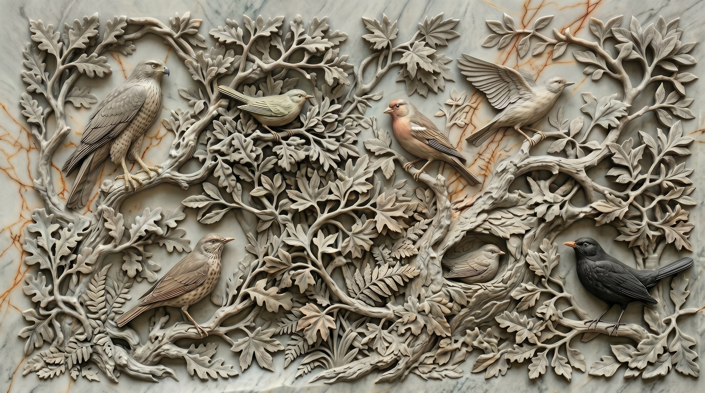
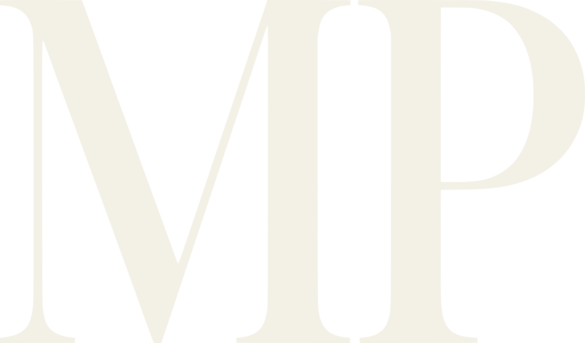

# mparklab.com — Claude Code Rebuild Instructions

> ⚠️ **SUPERSEDED — DO NOT FOLLOW (marked 2026-07-06).** This doc describes a June 25 Cowork rebuild that was replaced by the "Clean start — design system v2.1" commit on July 1 and the launch commits that followed. Its "Done" list (mega nav, command-center drafts) does not exist in the current site, and its pending design sweep would roll back v2.1 decisions. Kept for historical reference only. JP confirmed skipping it on 2026-07-06.

> Generated from the `/goal maestro` Cowork session. All work stays LOCAL — no live pushes.

---

## Project scope

Full rebuild of `03_WEBSITE_AND_BRAND/website/`. Static HTML site — no build system, no npm, all pages standalone with inline CSS + JS.

---

## Safety rules (non-negotiable)

- No live pushes to any hosting environment
- No sending email, SMS, DM, or calendar invites
- No deleting files — only add or replace
- No entering credentials or changing account settings
- No spending money

---

## Font system

### PP Woodland (display)

Files live at `website/font/pp-woodland/`. Four weights already copied:

```
PPWoodland-Ultralight.woff2  → weight: 300
PPWoodland-Regular.woff2     → weight: 400
PPWoodland-Bold.woff2        → weight: 700
PPWoodland-Heavy.woff2       → weight: 900
```

@font-face block (goes at top of every page `<style>` block):

```css
@font-face{font-family:'PP Woodland';font-style:normal;font-weight:300;font-display:swap;src:url('font/pp-woodland/PPWoodland-Ultralight.woff2') format('woff2');}
@font-face{font-family:'PP Woodland';font-style:normal;font-weight:400;font-display:swap;src:url('font/pp-woodland/PPWoodland-Regular.woff2') format('woff2');}
@font-face{font-family:'PP Woodland';font-style:normal;font-weight:700;font-display:swap;src:url('font/pp-woodland/PPWoodland-Bold.woff2') format('woff2');}
@font-face{font-family:'PP Woodland';font-style:normal;font-weight:900;font-display:swap;src:url('font/pp-woodland/PPWoodland-Heavy.woff2') format('woff2');}
```

### Font rules

- **All headlines**: `font-family: var(--display)` → `'PP Woodland', 'DM Sans', Helvetica, sans-serif`
- **Headline weight**: `font-weight: 400` (Regular). NOT 700, NOT 800, NOT 900. JP specifically dislikes heavy/bold headlines — they look AI-generated.
- **Body / UI text**: `font-family: var(--sans)` → `'DM Sans', Helvetica, Arial, sans-serif`
- **Eliminate Josefin Sans** — remove from all page font stacks or reduce to eyebrow/label text only
- **Eyebrow / label text**: minimum `0.85rem`. The old `0.68rem` is too small and "looks like Claude designed it"
- Two fonts max on any page: PP Woodland + DM Sans

---

## Color system

### CSS variables (`:root` block on every page)

```css
:root {
  /* Core palette */
  --moss:      #233328;
  --moss-deep: #1a2820;
  --fern:      #7EAF82;
  --terra:     #C17A55;   /* craftsman walnut — splashes only */
  --gold:      #C9A84C;   /* primary accent — replaces old --linen where warm is needed */
  --sage:      #A8C5A0;   /* lighter green, complements --fern */
  --cobalt:    #1B6BFF;   /* Vivid Blue — primary blue */
  --royal:     #0047AB;   /* Royal Cobalt — deep blue */
  --sky:       #0B84FF;   /* Sky Electric — lighter blue */

  /* Neutrals */
  --white:     #FFFFFF;
  --off-white: #F7F8F9;   /* replaces old --linen (#F3F0E6) — JP dislikes the cream */
  --linen-dim: rgba(247,248,249,0.65);

  /* Font stacks */
  --sans:    'DM Sans', Helvetica, Arial, sans-serif;
  --display: 'PP Woodland', 'DM Sans', Helvetica, sans-serif;
}
```

### Color direction

- **White + Blue dominate.** `--white` and `--cobalt` are the primary colors across all pages.
- Sections alternate: white bg with cobalt accents, or `--moss-deep` dark bg with `--fern` accents.
- **Terra (`--terra`)**: craftsman/walnut tone. Splashes only — borders, card accents, horizontal rules. Never the dominant color.
- **Gold (`--gold`)**: primary warm accent replacing terra where a "primary" color is needed. Pairs well with blues.
- **Greens (`--fern`, `--sage`)**: used to complement and amplify blues, not to compete with them. Greens make the blues pop.
- **No cream/linen** (`#F3F0E6`) anywhere. Replace every instance with `--off-white` (`#F7F8F9`) or `--white`.
- Each page can be "unexpectedly different" in character while staying inside the same palette.

### Old → new color mapping

| Old value | Replace with |
|-----------|-------------|
| `#F3F0E6` (linen) | `#F7F8F9` (off-white) |
| `var(--linen)` on dark bg | keep as is (it's readable on dark) — or swap to `--white` |
| `var(--linen)` on light bg | `var(--moss)` or `--cobalt` |
| Moss-green dominant sections | Flip to white + cobalt |

---

## Navigation (shared across all pages)

### HTML structure

```html
<div id="nav-overlay"></div>

<nav id="navbar">
  <!-- Bird logo LEFT of wordmark -->
  <a href="index.html" class="nav-logo">
    
    
  </a>

  <ul class="nav-links">
    <!-- Imagine dropdown -->
    <li class="nav-dd-parent">
      <button class="nav-btn" aria-haspopup="true" aria-expanded="false">Imagine</button>
      <div class="nav-mega">
        <div class="mega-col">
          <div class="mega-col-header">Your Opportunity</div>
          <a href="overview.html" class="mega-item">
            <span class="mega-item-title">Overview</span>
            <span class="mega-item-sub">See the full system in action</span>
          </a>
          <!-- ... all Imagine links ... -->
        </div>
        <div class="mega-col">
          <div class="mega-col-header">About</div>
          <!-- ... About links ... -->
        </div>
      </div>
    </li>

    <!-- Your Path dropdown (single column) -->
    <li class="nav-dd-parent">
      <button class="nav-btn" aria-haspopup="true" aria-expanded="false">Your Path</button>
      <div class="nav-mega nav-mega--single">
        <div class="mega-col">
          <div class="mega-col-header">Get Started</div>
          <a href="message.html" class="mega-item">...</a>
          <a href="https://calendly.com/mornpark/consultation" target="_blank" class="mega-item mega-item--price">
            <span class="mega-item-title">$149 · 30 Min Workflow Map</span>
            <span class="mega-item-sub">A no-pitch look at your day</span>
          </a>
          <a href="https://calendly.com/mornpark/basic-service" target="_blank" class="mega-item mega-item--price">
            <span class="mega-item-title">$499 · 1 Hour Deep Look</span>
            <span class="mega-item-sub">Paid deep-dive discovery session</span>
          </a>
        </div>
      </div>
    </li>
  </ul>

  <!-- Right: FAQ icon + hamburger -->
  <div class="nav-icons">
    <div class="nav-icon-dd-parent">
      <button class="nav-icon" aria-label="FAQ"><!-- ? SVG --></button>
      <div class="nav-icon-dropdown">
        <a href="faq.html" class="mega-item">...</a>
        <a href="about.html" class="mega-item">...</a>
      </div>
    </div>
    <button class="nav-icon" id="nav-hamburger" aria-label="Open menu"><!-- ☰ SVG --></button>
  </div>
</nav>
```

### Nav appearance

- White bar: `background: #fff; border-bottom: 1px solid rgba(0,0,0,0.07);`
- Bird logo left of wordmark — always
- Dropdown top gap: `top: calc(100% + 26px)` — shows sliver of hero below nav above dropdown
- Blur overlay on page when dropdown is open: `backdrop-filter: blur(5px)` on `#nav-overlay`

### Nav JS — timer-based hover (critical)

Without this, the 26px gap causes the dropdown to close when the mouse travels from nav button to dropdown.

```javascript
(function() {
  const overlay = document.getElementById('nav-overlay');
  const parents = document.querySelectorAll('.nav-dd-parent');
  let _ct;

  function closeAll() {
    parents.forEach(p => p.querySelector('.nav-mega')?.classList.remove('visible'));
    overlay.classList.remove('active');
  }
  function scheduleClose() { _ct = setTimeout(closeAll, 180); }
  function cancelClose()   { clearTimeout(_ct); }

  parents.forEach(parent => {
    const mega = parent.querySelector('.nav-mega');
    parent.addEventListener('mouseenter', () => {
      cancelClose(); closeAll();
      mega.classList.add('visible');
      overlay.classList.add('active');
    });
    parent.addEventListener('mouseleave', scheduleClose);
    mega.addEventListener('mouseenter', cancelClose);
    mega.addEventListener('mouseleave', scheduleClose);
  });

  overlay.addEventListener('click', closeAll);

  // Icon dropdown (FAQ)
  const iconParents = document.querySelectorAll('.nav-icon-dd-parent');
  iconParents.forEach(p => {
    p.addEventListener('mouseenter', () => p.querySelector('.nav-icon-dropdown')?.classList.add('visible'));
    p.addEventListener('mouseleave', () => p.querySelector('.nav-icon-dropdown')?.classList.remove('visible'));
  });

  // Mobile
  document.getElementById('nav-hamburger')?.addEventListener('click', () =>
    document.getElementById('mobile-menu')?.classList.add('open'));
  document.getElementById('mobile-menu-close')?.addEventListener('click', () =>
    document.getElementById('mobile-menu')?.classList.remove('open'));
  document.querySelectorAll('.mob-section-header').forEach(h =>
    h.addEventListener('click', () => h.parentElement.classList.toggle('open')));
})();
```

### Nav overlay CSS

```css
#nav-overlay {
  position: fixed;
  inset: 0;
  background: rgba(0,0,0,0.18);
  backdrop-filter: blur(5px);
  -webkit-backdrop-filter: blur(5px);
  z-index: 90;
  opacity: 0;
  pointer-events: none;
  transition: opacity 0.25s;
}
#nav-overlay.active { opacity: 1; pointer-events: all; }
```

---

## Marble + Crow Hero (advertise.html AND brand-adv-content.html)

This hero lives on both pages. It uses a marble background image, canvas spotlight carving effect, and a GSAP crow video flythrough.

### Required CDN (in `<head>`)

```html
<script src="https://cdnjs.cloudflare.com/ajax/libs/gsap/3.12.5/gsap.min.js"></script>
```

### Hero HTML

```html
<section id="hero">
  
  <canvas id="hero-canvas"></canvas>
  <video class="hero-bird-video" id="hero-bird-video"
         src="videos/crow-hero.mp4?v=6" muted playsinline disablepictureinpicture></video>
  <div id="hero-cursor"></div>
  <div class="hero-content">
    
  </div>
  <div class="hero-tagline">
    <span class="tag-line" id="tag-1">[Page-specific tagline line 1]</span>
    <span class="tag-line" id="tag-2">[Page-specific tagline line 2]</span>
  </div>
</section>
```

### Hero canvas JS

Canvas uses `destination-out` compositing to "carve" a spotlight through a dark overlay, revealing the marble image underneath. Cursor is lerp-smoothed. GSAP drives the crow flythrough.

See `advertise.html` lines 655–799 for the complete implementation — copy verbatim.

---

## index.html (Home page)

### Hero — AEO-first dark hero

Dark `--moss-deep` background, word reveal animation, no marble/crow. The marble+crow hero belongs on `brand-adv-content.html` and `advertise.html`.

### Industry marquee

Dual-track ticker (trades/industries). CSS `@keyframes marqueeLeft` / `marqueeRight`, pause on hover.

### Three demo boxes (section `#demo`)

Three cards side-by-side in a `demo-grid`. DO NOT reduce to one box.

1. **AI Receptionist** — animated phone ring + voice wave. Links to `tcm-request.html` for the live Vapi demo.
2. **Lead Input Flow** — animated typewriter fills Name → Phone → Service → Submit → Success. Loops automatically.
3. **Working Chat** — real conversational AI feel. User types, gets contextual canned responses (pricing, hours, call handling, CRM, reviews, AI tech). Seeded with an intro message.

### Proof cards

Three stat cards: 14 new leads, 100% after-hours coverage, 6hr admin saved. IntersectionObserver pulse animation on entry.

### Consult CTA section

Two Calendly links: $149 Workflow Map / $499 Deep Look.

### Footer

Columns: Brand+social | Imagine | Your Path | About. Already implemented — do not collapse or remove columns.

---

## Page inventory

All pages are built and live in `website/`. Each is standalone HTML.

| File | Description |
|------|-------------|
| `index.html` | Home — AEO hero, marquee, 3 demo boxes, proof cards, consult CTA |
| `advertise.html` | Advertising services — marble+crow hero |
| `brand-adv-content.html` | Branding, Ads & Content — marble+crow hero |
| `overview.html` | Linear-inspired command center overview, terminal boot sequence |
| `smart-web-apps.html` | Smart websites, apps, structured data — includes TCM apartment schema demo |
| `entity-seo.html` | SEO/GEO/AIO/AXO/RAG/Context acronym glossary grid |
| `leads.html` | Lead rental + capture — 3-step how-it-works |
| `training.html` | Two path cards (Train Team / Use Our Team) |
| `trust-safety.html` | 6 principle cards, platform cards, Q&A |
| `pricing.html` | Three pricing cards ($149/$499/Custom) + FAQ |
| `legal.html` | Four document cards (Privacy/Terms/Refund/SMS) |
| `command-center-draft-1.html` | Dashboard — stat row, activity log, pipeline, workflows |
| `command-center-draft-2.html` | Automations — filterable table, status pills, toggles |
| `command-center-draft-3.html` | Pipeline — Kanban, 5 stages |
| `command-center-draft-4.html` | Reviews — Google monitor, auto-reply, 3★ alert |
| `command-center-draft-5.html` | Pulse — chronological event timeline |

---

## smart-web-apps.html — apartment schema demo

The old `smart-website.html` had a TCM phone receptionist demo for apartment buildings. This section should live on `smart-web-apps.html`. It demonstrated structured data / schema markup for an apartment complex — specifically showing how a voice receptionist + schema helps the property surface in AI searches.

Restore from old `smart-website.html` around line 363.

---

## Command Center drafts (Linear design system)

Five drafts interlinked via shared sidebar nav. Dark theme:

```css
--bg: #0d1117;
--sidebar: #111419;
--card: #161b22;
--border: rgba(255,255,255,0.07);
--text: #e6edf3;
--text-muted: #7d8590;
--accent: #238636;
```

Sidebar links each point to the correct draft filename. All drafts use the same sidebar component.

---

## Global animation patterns

### IntersectionObserver reveal (all pages)

```javascript
const io = new IntersectionObserver(entries => {
  entries.forEach(e => {
    if (e.isIntersecting) { e.target.classList.add('visible'); io.unobserve(e.target); }
  });
}, { threshold: 0.15 });
document.querySelectorAll('.reveal').forEach(el => io.observe(el));
```

CSS: `.reveal { opacity:0; transform:translateY(24px); transition: opacity 0.9s ease, transform 0.9s ease; }`
CSS: `.reveal.visible { opacity:1; transform:translateY(0); }`

### Word reveal

Splits headline into `<span>` words, staggers opacity+translateY with IntersectionObserver. See `index.html` word-reveal section.

### Terminal boot sequence (`overview.html`)

Sequential `setTimeout` chain, each line animates height `0 → 1.9em` + opacity `0 → 1`. Creates typewriter-without-typewriter feel.

### Chatbot typing indicator

3 dots → pulse animation → message fades in. Pattern:
```javascript
// Show .chat-typing div (3 pulsing dots) for 900ms
// Then remove typing div, append message
```

---

## Pending design shifts (apply globally)

These were requested but not yet implemented across all pages. Apply as a sweep:

1. **Replace `--linen` (`#F3F0E6`) everywhere** → use `--off-white` (`#F7F8F9`) or `--white` on light sections, keep `var(--linen)` only where it's text color on dark backgrounds.

2. **PP Woodland weight → 400 (Regular) for all headlines.** Find every `font-weight: 700|800|900` on a `var(--display)` element and drop it to `400`.

3. **Remove Josefin Sans dependency** — eliminate `font-family: 'Josefin Sans'` from all main content. Replace with `var(--sans)`. Only keep if needed for eyebrow/label text and only if already loading the Google Font anyway.

4. **Eyebrow / label text size → `0.85rem` minimum.** Find all `font-size: 0.68rem` or `0.62rem` instances and bump to `0.85rem`.

5. **Shift dominant palette from moss-green → white + cobalt blue.** Where a section has `background: var(--moss)` or `background: var(--moss-deep)` and it's a non-hero content section, consider flipping to `background: var(--white)` with `color: var(--moss)` and `--cobalt` accents.

6. **Blues**: Use `--cobalt` (#1B6BFF) as the primary interactive / accent blue. `--royal` (#0047AB) for depth/borders. `--sky` (#0B84FF) for hover states. Greens should complement blues, not compete.

---

## File path reference

```
website/
├── index.html               ← home
├── advertise.html           ← marble+crow hero
├── brand-adv-content.html   ← marble+crow hero (same)
├── overview.html
├── smart-web-apps.html      ← needs apartment schema demo restored
├── entity-seo.html
├── leads.html
├── training.html
├── trust-safety.html
├── pricing.html
├── legal.html
├── command-center-draft-1.html through 5.html
├── font/pp-woodland/        ← 4 woff2 files
├── images/marble-park.jpg   ← hero background
├── videos/crow-hero.mp4     ← crow flythrough
├── videos/bluebird-footer.webm
├── logo/morning-park-logo-warm-linen.svg
├── logo/morning-park-logo-deep-moss.svg
└── Images/bird_BLACK.svg    ← nav bird icon
```

---

## What's done vs. what's pending

### Done (in this session)
- Nav: white bar, bird+wordmark, Intercom-style mega dropdowns (Imagine + Your Path), timer-based hover (180ms), blur overlay, FAQ icon right side
- index.html: AEO hero, word reveal, industry marquee, 3 demo boxes (Receptionist + Lead Flow + Working Chat), proof cards, consult CTA, footer with Imagine/Your Path columns
- brand-adv-content.html: marble+crow hero transplanted from advertise.html
- PP Woodland font: 4 weights loaded, wired as `--display` on all 11 pages
- All new pages: overview, smart-web-apps, entity-seo, leads, training, trust-safety, pricing, legal
- 5 Command Center drafts (Linear design system)

### Still pending
- Apply color palette shift (white+blue dominant) across all pages
- Drop PP Woodland to weight 400 on all pages
- Remove Josefin Sans or reduce to tiny role
- Bump eyebrow text to 0.85rem+
- Replace all `#F3F0E6` instances
- Restore TCM apartment schema demo on smart-web-apps.html
- Apply blues consistently (--cobalt, --royal, --sky) as accent/interactive colors
